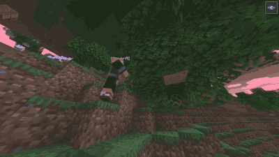
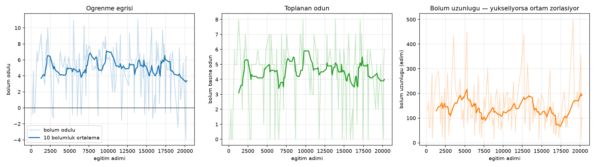
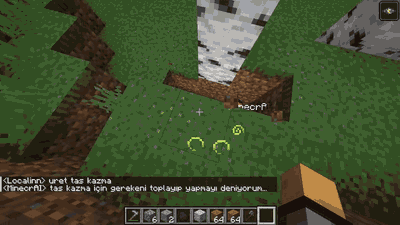
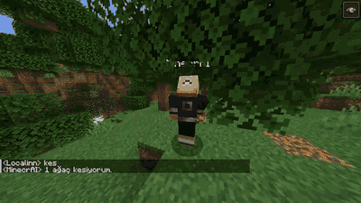

<div align="center">

# MinecrAI

**A Minecraft agent that learns to gather resources with reinforcement learning.**

Mineflayer (Node.js) drives the game. A WebSocket bridge exposes it to Python as a
standard Gymnasium environment, so any RL algorithm can train against real Minecraft.

[](https://nodejs.org)
[](https://python.org)
[](https://gymnasium.farama.org)
[](LICENSE)



*The trained PPO policy playing live. No scripted navigation — every step is
`forward` / `turn` / `break`, chosen by a network trained for 20k steps against
a real Minecraft server.*

</div>

---

## Why this project

Most "Minecraft bot" projects are long chains of `if/else`. This one is not.
The goal is a real learning loop: an explicit environment definition, a shaped
reward function, a training loop, and a learning curve you can point at.

The hard part is not the bot — it is turning a live, asynchronous game into
something an RL algorithm can actually step through. That bridge is the core
contribution here.

## Architecture

```
┌──────────────────┐   WebSocket    ┌─────────────────────┐   protocol   ┌───────────────┐
│  Python          │   JSON msgs    │  Node.js            │   packets    │  Minecraft    │
│                  │ ─────────────► │                     │ ───────────► │  Java server  │
│  Gymnasium Env   │                │  Mineflayer bot     │              │  (1.20.4)     │
│  PPO / SB3       │ ◄───────────── │  + pathfinder       │ ◄─────────── │               │
│                  │  obs, reward   │  + skills           │  world state │               │
└──────────────────┘                └─────────────────────┘              └───────────────┘
        │                                     │
        │                                     └── bot/bridge/environment.js
        │                                         observation, reward, episode logic
        │
        └── python/minecrai/env.py
            gym.Env: reset() / step(action) / observation_space / action_space
```

Design rationale — why a bridge, how the observation and reward were chosen, and
the reward-hacking trap that shaped the coefficients — is written up in
**[docs/architecture.md](docs/architecture.md)**.

**Why a bridge instead of doing everything in one language?**
Mineflayer is the only mature Minecraft client library, and it is Node.js.
The RL ecosystem (Gymnasium, Stable-Baselines3, PyTorch) is Python. Rather than
reimplementing either side, the bridge keeps each in its own language and defines
one narrow contract between them — documented in [`bot/bridge/protocol.md`](bot/bridge/protocol.md).

### Action space — `Discrete(5)`

| # | Action |
|---|--------|
| 0 | Walk forward (0.5 s) |
| 1 | Turn right (22.5°) |
| 2 | Turn left (22.5°) |
| 3 | Break the block in front — the log if there is one, otherwise whatever blocks the way (leaves) |
| 4 | No-op |

An earlier version had a "pathfind to the nearest tree" action. It was removed:
it performed the entire navigation in one step, so an agent that discovered it
would never learn to navigate. Removing it is what makes the learning curve
mean something.

### Observation space — `Box(19,)` for wood, `Box(23,)` for mining

Relative direction and distance to the target log, yaw/pitch, wood gathered this
episode, health, hunger, whether a log is in front, ground contact, episode
progress, and four local obstacle sensors: blocked ahead / left / right, and
whether a jumpable step is in front.

Node sends 16 raw numbers; the Python side derives three more — the target's
bearing **in the bot's own frame** (angle, sin, cos) — before the network sees
them. The raw vector gives direction in world coordinates and yaw separately, so
"is the target on my left" requires an `atan2` the network would have to learn.
Handing it over directly makes the turn decision readable from one number's sign.
Nothing new is measured; it is a change of frame, which is why it applies
retroactively to already-recorded demonstrations.

The obstacle sensors and this reframing both exist so the expert's decisions are
**realizable from the observation**. See `docs/architecture.md` — measured, not
assumed.

### Reward

```
r = 1.00 · (wood gained)
  + 0.20 · (log broken)
  + 0.05 · (blocks closer to nearest log)
  - 0.01 · (time penalty per step)
```

Episode terminates at 5 logs collected, truncates at 500 steps.

## Results

### Training (Milestone 4)

PPO, warm-started from the cloned policy, ran for **20,234 steps / 150 episodes**
(~59 min of live Minecraft) against the real server.

| | start | end | change |
|---|---|---|---|
| Mean reward | +4.46 | +4.61 | +0.15 |
| Episode length | 152 steps | 123 steps | **−19%** |

Reward is close to flat, and that is expected rather than disappointing: the episode
**terminates at 5 logs**, so reward is capped by construction. Once a policy reliably
reaches the cap, the only place improvement can still show up is *how fast* it gets
there — and that is exactly the column that moved. A learning curve that reports only
reward would have shown nothing here.



### Evaluation

Four policies, **20 episodes each**, round-robin ordering (policy 1, 2, 3, 4, 1, 2, …)
so a forest that thins out over the session penalises everyone equally rather than
whoever ran last. `±` is the standard error of the mean.

| policy | reward | wood | steps |
|---|---|---|---|
| **ppo** | **+4.07 ± 0.77** | **3.5** | 91 |
| bc | +2.84 ± 0.67 | 2.6 | 98 |
| random | +1.14 ± 0.74 | 2.4 | 129 |
| scripted expert | +0.55 ± 0.55 | 1.1 | 88 |

Per-episode variance is large (sd ≈ 3.3), so the honest reading is pairwise rather
than a leaderboard. Taking "difference greater than the sum of the two standard
errors" as the bar:

- **ppo > random** — 2.93 vs 1.51. Significant. This is the headline: the trained
  agent beats the random baseline.
- **ppo > scripted expert** — 3.52 vs 1.32. Significant.
- **bc > random** — 1.70 vs 1.41. Significant, narrowly.
- **ppo > bc** — 1.23 vs 1.44. **Not significant.** PPO leads on all three columns
  (reward, wood, steps), which is suggestive, but 20 episodes cannot separate it from
  behaviour cloning. Claiming otherwise would be reading noise.

`eval_agent.py` prints all pairs and estimates how many episodes the top pair would
actually need, instead of comparing only the top two and calling it a ranking.

### Why the scripted expert scores last

It is deterministic. When it faces a situation its priority list handles badly —
a log wedged behind leaves, a two-block ledge — it makes the same wrong decision
every step until the stagnation cutoff fires. The learned policies sample their
actions, so they jitter out of the same trap within a few steps. The expert is still
good enough to be worth imitating (it produced the demonstrations both learned
policies came from); it just has no escape hatch.

The same effect appeared inside behaviour cloning: evaluating the cloned policy with
`argmax` froze it in 3 of 5 episodes, and switching to sampling raised it from 1.6 to
5.0 logs per episode without retraining anything.

## Roadmap

| Milestone | What | Status |
|---|---|---|
| **1** | Rule-based bot: connect, pathfind, chop trees, collect drops, cancellable tasks | ✅ Done |
| **2** | Node↔Python bridge + Gymnasium environment + random-agent baseline | ✅ Done |
| **3** | Behaviour cloning from scripted demonstrations | ✅ Done |
| **4** | PPO training warm-started from the cloned policy, learning curve | ✅ Done |
| **5a** | Extended skill set: mining, smelting, recursive crafting | ✅ Done |
| **5b** | Mining as a *second RL task* on the same environment | ✅ Done |
| **6** | One agent, both tasks — multi-task RL | 🟡 Implemented, not yet trained |

Each milestone stands on its own — the repo is presentable at any point.

### Milestone 5 — resource acquisition as a search problem

`uret <item>` does not follow a hard-coded procedure. It resolves the recipe
tree at runtime and knows three ways to obtain anything:

```
craft (crafting table)  →  smelt (furnace)  →  gather (mine / chop)
```

Asking for an iron pickaxe with an empty inventory produces this chain, none of
which is written down anywhere:

```
iron pickaxe  ← 3 iron ingots + 2 sticks
  iron ingot   ← not craftable → furnace
    raw iron   ← not craftable → mine it
      stone pickaxe ← needed first → craft
        cobblestone ← mine it
          wooden pickaxe ← needed first → craft
            logs ← chop a tree
    furnace    ← 8 cobblestone
    fuel       ← coal, or the logs it already has
  stick        ← planks ← logs
```



*One command in, a stone pickaxe out. The bot chops a tree, crafts planks and
sticks, places a crafting table, mines stone, and assembles the pickaxe — the
chain is derived at runtime, not written down.*

Two design notes worth reading the code for:

**Species-agnostic gathering.** Sticks have ~12 recipes, one per wood type. With
an empty inventory they all score equally, so the bot used to pick one at random
and insist on it — asking for spruce in an oak forest. The material scorer now
looks two levels deep (is this obtainable, not just craftable?), and after
gathering it re-scores with what actually arrived. The bot adapts to the forest
instead of predicting it.

**No dependency cycle.** `kaz` needs `uret` to make a pickaxe; `uret` needs `kaz`
to get ore. Rather than have the two modules require each other, `uret` knows
only whether something is *obtainable* — the *how* is injected from
`bot/skills/index.js`. The dependency graph stays acyclic.

Mining is safety-first: staircase descent (never straight down), lava scanning
ahead of the tunnel, health monitoring with retreat, pickaxe-durability planning
computed from the depth of the job, and a stuck-detector that frees the bot by
digging its own way out rather than reporting failure.

## Milestone 5b — the same environment, a second task

The interesting claim here is not "the bot can mine". It is that **mining reuses
the environment, the action space, the reward shape, the training scripts and
the evaluation harness unchanged.** Only a handful of questions differ between
the two tasks, and they live in one file (`bot/bridge/gorevler.js`):

| question | wood | mining |
|---|---|---|
| `hedefMi(block)` | is it a log? | is it an ore? |
| `dogalMi(bot, block)` | not a player's house | **is my pickaxe good enough for it?** |
| `say(bot)` | logs in inventory | ores + ingots |
| `engelKirilabilirMi` | leaves and plants | stone too (we carry a pickaxe) |
| `hedefMaliyeti` | straight-line distance | vertical difference costs 3× |
| `aramaYaricapi` | 64 blocks | **16 blocks** |
| `baslangictaYurut` | yes | **no** — pathfinder would dig the tunnel *for* the agent |

Everything the agent learns — walking, turning, breaking, when to give up on an
unreachable target — is shared. `python/minecrai/yollar.py` keeps each task's
data and models in separate files so neither can silently overwrite the other.

The observation is task-dependent: wood stays at 16 raw values (Milestone 4's
trained models expect that width and still load), mining takes 20. The four
extra numbers are the **egocentric direction and distance of a dropped item**
and **whether the block in front is one I can break** — both used by the
scripted expert, neither previously visible to the learner. See below for why
that mattered.

### Results

Behaviour cloning on 2,606 demonstration steps reached **75.1 %** action
accuracy; a matching PPO-architecture run reached **74.9 %**, and the two
agreeing is the sanity check. PPO then trained for **20,407 steps / 221
episodes** (~120 min live).

Five policies, **9 rounds**, round-robin ordering. `±` is the standard error.

| policy | ore / episode | median |
|---|---|---|
| random | 2.44 ± 1.03 | 0 |
| behaviour cloning | 4.89 ± 0.84 | 5 |
| PPO — imitation only, no RL | 4.78 ± 1.12 | 5 |
| **PPO — imitation + RL** | **6.00 ± 1.43** | 5 |
| scripted expert | 9.11 ± 3.63 | 6 |

**What can be claimed:** the trained agent beats the random baseline — paired
per-round difference **+3.56, 95 % interval +0.22 … +6.89**, which excludes zero.

**What cannot:** whether RL added anything on top of imitation. That is the
`imitation only` vs `imitation + RL` pair, and it is deliberately the *same
network, same architecture, same sampling* — the only difference is the RL
training, so the comparison is well-posed. Paired differences were
`0, +5, +4, 0, +2, −3, −5, +5, +3`: mean **+1.22**, 95 % interval
**−1.49 … +3.94**. It contains zero.

Rather than run more rounds until something looked significant, the observed
spread says how many would actually be needed: **~98 rounds**, roughly five
hours of live Minecraft, to resolve a one-ore difference. That was judged not
worth it for this project, and the honest result is reported instead.

The scripted expert's mean is inflated by a single episode that hit a lapis vein
and returned 36 items — its median (6) is the more useful number, and its
standard error (±3.63) is larger than the entire gap it is supposed to
demonstrate. Lapis and redstone drop 4–9 items per block, so "collect 5
resources" is sometimes settled by one lucky block. This is a known and accepted
limitation: the task definition is applied identically to every policy, so it
does not bias the comparison, but it does inflate the variance that made the
comparison above inconclusive.

Milestone 4 hit the same wall — `ppo > bc` was not separable — but could not say
*why*, because `bc` and `ppo` are different networks trained by different
procedures. The imitation-only/imitation+RL pairing was added here so the
question at least has a well-posed answer, even when that answer is "not
measurable at this budget".

### Five bugs this milestone found, and how

Every one was caught by measurement rather than by reading code. The reason
distribution printed by `gorev_kontrol.py` and the data-health line printed by
`collect_demos.py` exist because of them.

1. **Tool lookup missed 439 blocks.** `aletTipi()` matched block names against a
   hand-written regex that did not know `tuff`, `calcite`, `smooth_basalt`,
   `amethyst_block` or `dripstone_block` — which is most of what fills a cave at
   y=15. The bot stood in front of tuff holding an iron pickaxe, concluded it had
   no suitable tool, and tried to walk around it forever: **4 episodes, zero
   digs, zero ore.** Fixed by reading the game's own `block.material`. A test now
   compares every block in `minecraft-data` against the lookup: 439 → 0.

2. **Digging through walls.** Mineflayer's `canDigBlock()` checks distance only
   (`digging.js`: `distanceTo(...) <= 5.1`), not line of sight, and the server
   accepts the dig. The bot was mining ore four blocks away *through solid
   stone*; the drop landed on the far side, unreachable. It collected the
   "block broken" reward while nothing entered its inventory — and worse, was
   rewarded for reaching ore **without digging the tunnel**, short-circuiting the
   task it was supposed to learn. Fixed with `bot.canSeeBlock()`.

3. **Always breaking the diagonal.** Forward sampling ran `[-0.35, 0, +0.35]` and
   returned the *first* hit, so the bot cleared the left-diagonal block and left
   the one actually in its way. Ordering the centre first fixed it. The first
   version of that test placed the bot at the centre of a block, where a 0.35
   lateral offset lands in the same block — it passed with the bug still present.

4. **A 64-block search radius underground.** `findBlocks` sees through walls, and
   at y=15 there is always an ore within 64 blocks — forty blocks behind stone.
   The environment therefore never believed the area was exhausted, never
   relocated, and the agent spent every episode tunnelling toward something it
   could not reach: **episode 1 collected 5 ore, episodes 2–18 all zero.**
   Mining now searches 16 blocks; the forest still searches 64, where 64 blocks
   is open ground.

5. **The most expensive one: frozen observations.** `MinecraftEnv.step()` did not
   update the raw observation used for demo recording, so it stayed at its
   `reset()` value for the whole episode. Every sample within an episode carried
   the *same* observation and a *different* action. Measured: **4,498 samples,
   30 unique observation rows** — exactly the episode count, 100 % contradictory.
   The ceiling for such data is the majority class (33.2 %); cloning scored
   30.7 % and the loss sat at exactly `ln(4) = 1.386`, meaning the network had
   learned to emit a uniform distribution and nothing else.

   Two demo-collection runs (~45 min of live Minecraft) were wasted before this
   was found, and the first diagnosis was wrong. The lesson is recorded in the
   code: **when a network will not learn, look at the data before forming a
   hypothesis.** Opening the file and counting unique rows took two minutes and
   was decisive. `collect_demos.py` now prints that count after every run, and
   `test/smoke.py` catches the underlying bug with a fake bridge in seconds.

## Milestone 6 — one agent, both tasks *(implemented, not yet trained)*

Milestone 5b showed the *environment* generalises to a second task. Milestone 6
asks the harder question: can **one network** do both, told only which task it is
in?

The code is in place and covered by tests; the training runs are pending. Two
design decisions carry the milestone.

**A shared observation width.** Wood sends 16 numbers, mining sends 20 (mining
needs the dropped-item direction and the "can I break what is in front of me"
bit). One network needs one input size, so multi-task mode asks the bridge for the
wide observation on *both* tasks — `reset` carries a `genisGozlem` flag. Wood keeps
its narrow default outside multi-task mode, so Milestone 4's trained models still
load.

**The task must be visible to the network.** This is the part worth arguing for.
Given the same observation — *there is stone in front of me* — the correct action
is "go around it" in the wood task and "break it" in the mining task. Without a
task signal those two labels land on identical inputs and the network learns their
average, which is neither. Milestone 5b produced a different route to the same
failure (a frozen observation made every sample in an episode contradictory, and
the loss parked at exactly `ln 4`), so the shape of it is already familiar: **if
the distinguishing information is not in the observation, there is nothing to
learn.** The task index rides in the raw recording as a single column and is
expanded to a one-hot at training time — 25 inputs in total.

Tasks alternate strictly rather than being drawn at random: over a short run,
random selection produces lopsided splits (19/11 in 30 episodes) that quietly bias
any "which task is it better at" comparison.

`CokluGorevEnv` is an ordinary `gym.Env` from the outside, so `collect_demos.py`,
`train_ppo.py` and `eval_agent.py` accept `--gorev hepsi` with no special cases —
the one branch lives in `ortam_kur()`, because a branch repeated in five scripts is
a branch one of them will eventually be missing.

Two bugs surfaced while writing this, both of the silent kind:

- **The search radius did not follow the task.** `server.js` swapped `env.gorev` on
  a task change, but the radius was a field computed once in the constructor. Under
  multi-task training the task changes every episode, so a bot switching from wood
  to mining would have kept the 64-block radius — reintroducing the Milestone 5b
  failure (locking onto unreachable targets) with no visible symptom. It is a
  derived property now, so forgetting to update it is not expressible.
- **Task switching kept the locked target and the blacklist.** A target chosen in
  the forest is meaningless underground. Both are cleared in `gorevDegistir()`,
  which is now the single entry point for a task change.

`gozlemleri_hazirla` also moved into `minecrai/veri.py`. It existed as two
byte-identical copies in `train_bc.py` and `pretrain_ppo.py`, and the same fix had
already had to be applied twice; a third divergence would have meant the two
scripts silently interpreting the same data differently, with both still running.

## Quick start

**Requirements:** Node.js 18+, Python 3.10+, Java 21 (for the Minecraft server).

### 1. A local Minecraft server

The bot joins a server as an ordinary player, so you need one running. Download the
[1.20.4 vanilla server jar](https://mcversions.net/download/1.20.4) into its own
folder, then:

```bash
java -Xmx2G -jar server.jar nogui     # fails once and writes eula.txt
```

Set `eula=true` in `eula.txt`, then in `server.properties`:

```properties
online-mode=false        # let the bot join without a Mojang account
difficulty=peaceful      # no mobs interrupting training
spawn-protection=0       # the bot may break blocks near spawn
```

Start it again and leave it running. Launch your own client on **1.20.4** and
connect to `localhost` if you want to watch.

### 2. Install and run

```bash
npm install
python -m venv .venv && .venv/Scripts/activate     # Windows; use bin/activate on Linux/macOS
pip install -r python/requirements.txt

cp .env.example .env        # edit if your server is not on localhost:25565

npm run bot                 # Milestone 1
```

Then type in the in-game chat:

| Command | Effect |
|---|---|
| `gel` | Walk to the player who typed it |
| `kes` | Find the nearest tree, chop it, pick up the drops |
| `kes 3` | Chop 3 trees (1-64) |
| `kes surekli` | Keep chopping until told to stop |
| `envanter` / `nerede` | Report inventory / coordinates |
| `takip` | Follow the player until told to stop |
| `ver odun 10` | Toss items from the bot's inventory |
| `uret demir kazma` | Craft anything — the bot resolves the recipe tree itself |
| `kaz elmas 10` | Mine an ore: descends by staircase, equips the right pickaxe |
| `cik` | Pillar up to the surface (if it gets stuck in a cave) |
| `koru` | Mark a no-dig zone around you — the bot never breaks blocks there |
| `komut` | List every command |
| `dur` | Abort the current task immediately |



*`kes 3` — find the nearest natural tree, fell it trunk to canopy (pillaring up
when the top is out of reach), collect the drops, repeat.*

### 3. The RL loop (Milestone 2)

```bash
npm run bridge                        # terminal A
cd python && python random_agent.py   # terminal B
```

Rewards will be negative — this baseline acts randomly and does not learn.

### 4. Learning from demonstrations (Milestone 3)

```bash
npm run bridge                        # terminal A
# terminal B:
cd python
python collect_demos.py --bolum 40    # record the scripted expert
python train_bc.py --epoch 60         # train a policy to imitate it
python eval_agent.py --bolum 10       # random vs learned vs expert
```

`train_bc.py` writes a loss/accuracy plot and `eval_agent.py` writes the
random-vs-learned-vs-expert comparison to `models/`.

### 5. Reinforcement learning (Milestone 4)

```bash
cd python
python pretrain_ppo.py --epoch 80              # hand the cloned policy to PPO (offline)
# terminal A: npm run bridge
python train_ppo.py --baslangic ../models/ppo_pretrained.zip --adim 20000
python plot_ogrenme.py                         # learning curve, safe to run mid-training
```

**On wall-clock cost.** A step in live Minecraft takes roughly 0.4 s, so 20k steps
is about two hours. Training is therefore built to be interrupted: every episode is
appended to `models/ppo_gecmis.csv`, a checkpoint is written every 1000 steps, and
`Ctrl+C` exits cleanly. `--devam` resumes from the last checkpoint, and
`plot_ogrenme.py` will draw the curve from a partial run.

**Why warm-start rather than train from scratch?** A fresh PPO policy acts randomly,
and at 0.4 s per step it would take many hours before the first useful behaviour
appears. `pretrain_ppo.py` trains Stable-Baselines3's own policy object with a
supervised loss on the demonstration data, so PPO starts from a policy that already
solves the task and spends its budget improving rather than discovering.

> Türkçe okuyanlar için mimari notları: [`docs/mimari.md`](docs/mimari.md)

## Repository layout

```
bot/                  Node.js — everything that touches Minecraft
  index.js              Milestone 1 entry point (chat-controlled bot)
  config.js             all settings, read from .env
  skills/               reusable behaviours
    chopTree.js           find, fell and collect whole trees
    kaz.js                mining: staircase descent, ore veins, lava safety
    uret.js               recursive crafting — resolves the recipe tree
    erit.js               smelting (furnace), the craft→smelt bridge
    sutun.js              pillar up / dig down to reach unreachable blocks
    alet.js, gel.js, takip.js, ver.js
  utils/gorev.js        cancellation, safe pathfinder stop, stuck detection
  utils/kurtar.js       frees the bot when it wedges itself
  utils/yerlestir.js    block placement — clears a spot if none is free
  utils/koruma.js       player-marked no-dig zones
  bridge/
    server.js           WebSocket server exposing reset/step to Python
    environment.js      observation, reward and episode logic
    expert.js           scripted expert expressed in the agent's action space
    protocol.md         the Node↔Python contract
python/
  minecrai/
    bridge.py           WebSocket client
    env.py              gymnasium.Env implementation
  random_agent.py       baseline: random actions, proves the loop works
  collect_demos.py      Milestone 3: record the scripted expert
  train_bc.py           Milestone 3: behaviour cloning + training plots
  eval_agent.py         Milestone 3: random vs learned vs expert comparison
  minecrai/policy.py    the imitation network (PyTorch MLP)
  pretrain_ppo.py       Milestone 4: warm-start SB3's policy from demonstrations
  train_ppo.py          Milestone 4: PPO with checkpointing and CSV logging
  plot_ogrenme.py       Milestone 4: the learning curve
  requirements.txt
docs/
  architecture.md       design rationale — read this first
  mimari.md             same notes in Turkish
test/
  smoke.js              fast runtime test with a fake bot — no Minecraft needed
  e2e.js                automated test against a local flying-squid server
```

## Tests

`test/e2e.js` spins up an in-process Minecraft server (`flying-squid`), builds a
flat platform, plants trees and asserts two things — that the bot finds and chops
a tree, and that a `dur` (stop) request actually aborts an in-progress chop.
No manual Minecraft client needed.

```bash
node test/e2e.js
```

`test/smoke.js` is the fast one (~1 s, no server at all): it drives the environment,
the expert and the skills against a fake bot object. It exists because of a real bug —
a careless search-and-replace produced `this.pathfinderDurdur(bot)`, which is valid
syntax and passes every `require()` check, then throws `bot is not defined` only once
that line actually runs, mid-episode. Import checks cannot catch that class of bug;
executing the code can.

```bash
node test/smoke.js
```

`test/smoke.py` is the same idea for the Python side (~20 s, no server): it runs
`train_bc.py` and `pretrain_ppo.py` end to end on synthetic data for both tasks,
and drives the Gym environment against a fake bridge. It exists because the same
class of bug reached the user twice — most recently a `NameError` that surfaced
immediately *after* a 40-minute demo-collection run. `python -m py_compile` does
not catch these: the syntax is valid and the failure is at runtime. One of its
checks reproduces the frozen-observation bug described above by asserting that
the recorded observation actually changes from step to step.

```bash
python test/smoke.py
```

Run both after changing anything.

## License

MIT — see [LICENSE](LICENSE).
